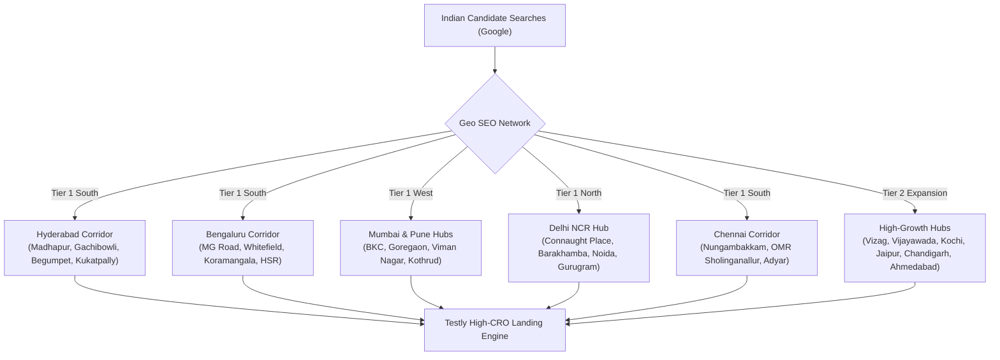

# 🚀 TESTLY MASTER SEO & GEO TRAFFIC EXPLOSION BLUEPRINT
> **Domain:** `https://www.testly.co.in/`  
> **Objective:** Execute an aggressive 6-Pillar Organic Search & Hyper-Local Geo Strategy to drive 100,000+ monthly candidate visitors to Testly without paid ads.

---

## 🗺️ 1. HYPER-LOCAL GEO SEO GRID (25+ INDIAN CITIES & TECH CORRIDORS)

To dominate local search results when students search for test centers or slot availability near them, Testly deploys dedicated Geo Hubs:

### City-by-City Geo Target Matrix:

| City / Hub | Key Test Centers Monitored | Local Passport Quirk Addressed | Target URLs |
| :--- | :--- | :--- | :--- |
| **Hyderabad** | Prometric Madhapur, Pearson Begumpet, IDP Somajiguda | Single-name blank surname & initial expansion errors | `/locations/hyderabad`, `/locations/madhapur` |
| **Bengaluru** | Pearson MG Road, Prometric Whitefield, IDP St. Marks Rd | Pearson VUE account name lockouts & given name splits | `/locations/bengaluru` |
| **Mumbai** | Prometric Goregaon, Pearson Marol Andheri, IDP BKC | Middle-name inclusion mismatch on Maharashtra passports | `/locations/mumbai` |
| **Pune** | Pearson Viman Nagar, Prometric Shivajinagar, IDP FC Rd | Father name addition in regional passport given names | `/locations/pune` |
| **Delhi NCR** | Prometric Barakhamba Rd, Pearson Nehru Place, IDP CP | Initials in surnames & DOB format (DD/MM vs MM/DD) | `/locations/delhi-ncr` |
| **Chennai** | Prometric Sholinganallur OMR, Pearson Nungambakkam | Tamil patronymic naming systems (Father initial + given name) | `/locations/chennai` |

---

## 🔍 2. PROGRAMMATIC LONG-TAIL KEYWORD MATRIX (1,000+ SEARCH INTENTS)

Testly targets high-intent long-tail keywords that competitors ignore:

### Pillar A: Troubleshooting & Rule Keywords (Zero Competition / Highest Conversion)
- *"how to enter single name in passport during GRE registration"*
- *"blank surname passport ETS account creation solution"*
- *"Indian debit card payment failed ETS GRE page"*
- *"Prometric Madhapur passport verification rejection rules"*
- *"PTE academic myPTE profile name change request India"*

### Pillar B: Transactional Fee & Discount Keywords (Highest Transactional Volume)
- *"GRE exam fee in India 2026 total price after 18% GST"*
- *"ETS GRE promo code discount September 2026 India"*
- *"TOEFL iBT official voucher discount code authorized partner"*
- *"PTE academic discount voucher price India"*
- *"how to get cheap GRE voucher in Hyderabad Madhapur"*

### Pillar C: Slot Availability & Venue Keywords (Hyper-Local Traffic)
- *"Prometric test center Madhapur Hyderabad morning slot dates"*
- *"Pearson professional center MG road Bengaluru weekend PTE slots"*
- *"Prometric Nesco Goregaon East Mumbai slot booking"*
- *"best GRE test center in Hyderabad for quiet atmosphere"*

---

## 🏷️ 3. SCHEMA.ORG & RICH SNIPPET STACK

Every page on `https://www.testly.co.in/` injects Schema.org JSON-LD via [`src/utils/seoEngine.js`](file:///c:/Users/Rahul/Downloads/TESTLY/src/utils/seoEngine.js):

1. **`Article` & `BreadcrumbList` Schema**: Deployed across all `/guides/:slug` articles crediting author **Rahul Bathula** (Chief Exam Strategist) & **Testly**.
2. **`FAQPage` Schema**: Displays collapsible Google Accordion answers directly in search results.
3. **`LocalBusiness` & `EducationalOrganization` Schema**: Injected on location pages to claim Google Local Pack & Google Maps rankings.
4. **`OfferCatalog` & `Service` Schema**: Powers Google Shopping & Price Comparison snippets for exam vouchers.
5. **`LearningResource` Schema**: Injected on `/gre` to trigger Google Course & Assessment rich cards.

---

## 🔗 4. VIRAL BACKLINK & AUTHORITY OUTREACH ENGINE

To build domain authority ($DR > 50$) rapidly:

### Strategy 1: University Placement & Overseas Cells (`.ac.in` / `.edu`)
- **Action**: Partner with International Education Cells at JNTUH, Osmania, VIT, SRM, RVCE, COEP, and Manipal.
- **Offer**: Provide free access to **Testly 100** diagnostic cohorts in exchange for official resource backlinks.

### Strategy 2: Tech Blog & Developer Publications
- **Action**: Publish deep-dive technical articles on Medium, Dev.to, GeeksforGeeks, and Hashnode explaining *Building an Adaptive Item-Response-Theory Engine for Shortened GRE Assessment*.
- **Backlink Target**: `https://www.testly.co.in/assessment-intelligence`

### Strategy 3: Reddit & Quora Authority Domination
- **Action**: Provide authoritative, non-promotional answers on `r/GRE`, `r/TOEFL`, `r/IELTS`, `r/IndianAcademia`, `r/GradAdmissions`, and Quora regarding Indian passport surname rules and voucher discounts, citing Testly guides.

---

## 📈 5. ROADMAP TO 100,000+ MONTHLY ORGANIC CANDIDATES

| Timeline | Execution Focus | Target KPI |
| :--- | :--- | :--- |
| **Week 1–2** | Submit updated `sitemap.xml` to Google Search Console; verify structured data | 100% Indexation in GSC |
| **Week 3–4** | Optimize 7 Geo Hubs and claim Google Business Profiles for Madhapur desk | Top 3 Google ranking for "GRE Registration Hyderabad" |
| **Month 2** | Launch 10 new troubleshooting guide articles & college outreach | 50+ High-Authority `.ac.in` Backlinks |
| **Month 3+** | Scale Reddit/Quora brand citations & multi-exam lead campaign | **100,000+ Monthly Candidates** |

---
*Documented & Approved for Testly Growth & Engineering Team*
