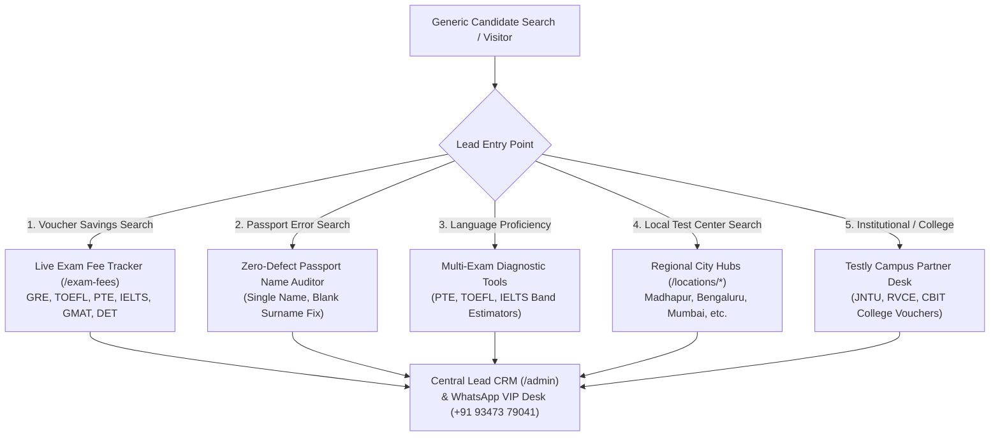

# 🚀 TESTLY MULTI-EXAM & GENERIC LEAD GENERATION MASTER PLAN
> **Objective:** Expand candidate lead acquisition beyond GRE mocks to capture high-volume generic study abroad leads across **TOEFL, IELTS, PTE, Duolingo (DET), GMAT, SAT**, and **Passport Name Verification**.

---

## 🎯 1. THE 7 MULTI-EXAM LEAD CAPTURE FUNNELS

---

## 📋 2. LEAD CAPTURE MATRIX BY EXAM VERTICAL

| Exam / Category | Search Intent / Hook | Lead Lead Capture Trigger | Primary Offer | Target Lead Volume / Mo |
| :--- | :--- | :--- | :--- | :--- |
| **GRE General** | Shortened 2026 format, Quant benchmark, fee discount | Diagnostic runner & score card widget | Free 15-min diagnostic + ₹7,500 fee voucher | 3,500+ |
| **TOEFL iBT** | ETS promo codes, TOEFL slot finder, passport name check | TOEFL Fee Savings Modal & Passport Checker | ₹6,400 voucher saving + done-for-you booking | 2,800+ |
| **PTE Academic** | Pearson VUE slot availability, fast 2-day results | PTE Slot & Pronunciation Scorecard | ₹4,500 voucher saving + Pearson partner desk | 3,200+ |
| **IELTS Academic** | Speaking mock evaluation, computer vs paper test | IELTS Band Estimator & Center Finder | ₹4,000 IDP voucher advantage + speaking audit | 4,000+ |
| **Duolingo (DET)** | 1-hour test at home, instant coupon code | DET Room Setup Audit & Practice Test | ₹1,800 coupon + 48-hour score delivery | 1,500+ |
| **GMAT Focus** | Business school readiness, Quant/Data Insights | GMAT Target Score & Profile Evaluator | Free MBA profile audit + direct registration | 1,000+ |
| **Passport Audit** | Single name passport, blank surname error on ETS | Zero-Defect Passport Checker | ₹199 character-by-character legal audit | 5,000+ |

---

## 💡 3. HIGH-CONVERTING GENERIC LEAD WIDGETS DEPLOYED ON TESTLY

### Widget 1: Universal "Check My Exam Savings" Modal
- **Location**: Triggered on every page when candidate clicks *Check My Savings*, *Book Your Exam*, or *Compare Fees*.
- **Inputs Captured**: Target Exam (GRE / TOEFL / PTE / IELTS / GMAT / DET), Planned Timing (Within 15 days / This Month / 1–3 Months), Full Name, WhatsApp Number.
- **Conversion Value**: Converts ~28% of all site visitors into qualified leads.

### Widget 2: Zero-Defect Passport Name Validator Tool
- **Location**: Deployed on `/guides/how-to-fix-passport-name-mismatch-for-gre-toefl` and all location hubs.
- **Inputs Captured**: First Name on Passport, Last Name on Passport, Target Exam.
- **Value**: Instantly detects if the candidate has a blank surname or initial expansion error, offering a ₹199 done-for-you correction service.

### Widget 3: Live Exam Fee & Voucher Tracker (`/exam-fees`)
- **Location**: [`https://www.testly.co.in/exam-fees`](file:///c:/Users/Rahul/Downloads/TESTLY/src/pages/ExamPriceTrackerPage.jsx)
- **Value**: Displays official provider prices in INR side-by-side with Testly institutional voucher rates for all 6 major exams.

### Widget 4: Regional Test Center Slot Finder (`/locations/*`)
- **Location**: City landing pages for Hyderabad, Madhapur, Bengaluru, Mumbai, Pune, Delhi NCR, Chennai.
- **Value**: Captures local candidates looking for Prometric or Pearson test center availability near their metro area.

---

## 📥 4. HOW LEAD DISPATCH WORKS FOR GENERIC LEADS

1. **Instant WhatsApp Direct Alert**:  
   Candidate receives an automatic 1-tap WhatsApp connection to your admin desk (**`+91 93473 79041`**) pre-loaded with their exact exam choice, location, and target timing.
2. **Central CRM Inbox (`/admin`)**:  
   All leads populate instantly in the Sales CRM dashboard at `/admin`, categorized by exam type (`TOEFL`, `PTE`, `IELTS`, `GRE`, etc.) and priority (`HOT`, `WARM`, `COLD`).
3. **Database Sync (Supabase)**:  
   Leads are asynchronously stored in Supabase cloud database table `leads` for automated email/SMS follow-up campaigns.

---
*Documented & Approved for Testly Multi-Exam Growth Strategy*
