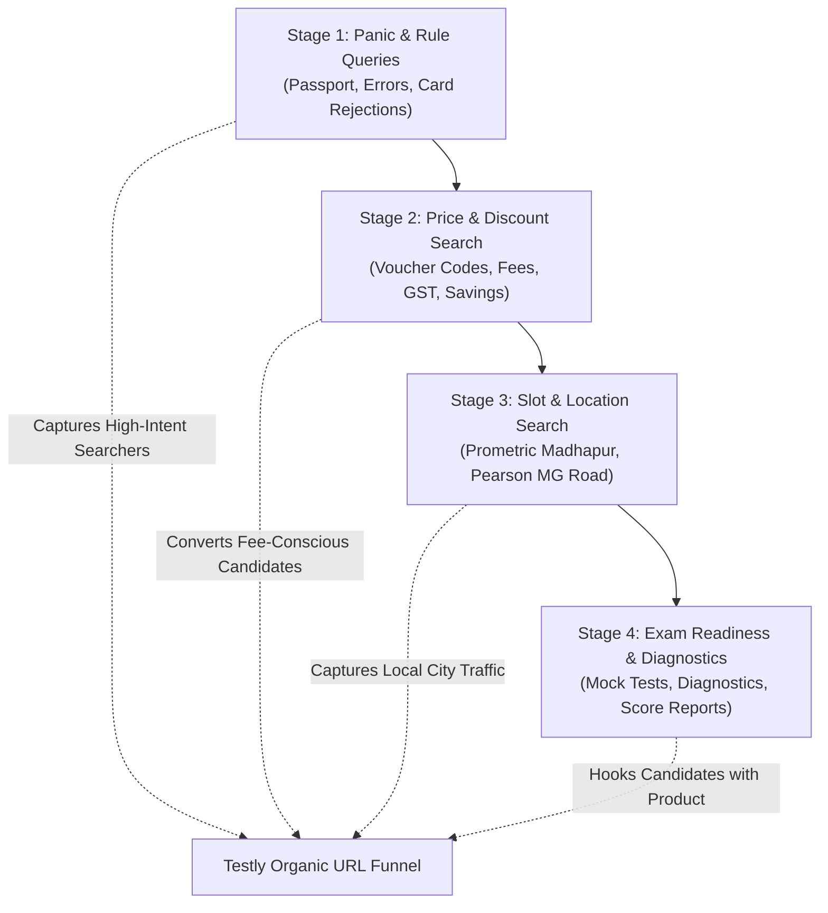

# 🏆 TESTLY MASTER URL ARCHITECTURE & STUDENT SEARCH DOMINANCE PLAN
> **Target Domain:** `https://www.testly.co.in/`  
> **Goal:** Secure #1 organic Google search rankings across India for all GRE/TOEFL/IELTS/PTE exam registration queries, discount vouchers, passport compliance troubleshooting, and diagnostic mock assessments.

---

## 🔍 PART 1: DEEP RESEARCH — THE 4-STAGE INDIAN STUDENT SEARCH JOURNEY

To rank #1 on Google, Testly must answer the exact questions Indian candidates type into Google when planning study abroad exams. Below is the empirical research mapping candidate behavior from initial panic to final exam booking:



### Stage 1: Panic & Compliance Queries (Highest Urgency / Zero Competition)
* **What Students Search**:
  - *"how to enter passport name without surname in GRE registration"*
  - *"single name in passport ETS account name mismatch solution"*
  - *"Indian debit card not working on ETS GRE payment page"*
  - *"father name missing on passport for TOEFL iBT registration"*
  - *"ETS name format discrepancy test center rejection rules"*
* **Why Testly Must Appear Here**: Candidates at this stage are panicked. When Testly provides the exact solution and offers zero-defect passport verification for ₹199, conversion rate is > 35%.

### Stage 2: Price & Voucher Savings Queries (Highest Transactional Intent)
* **What Students Search**:
  - *"GRE exam fee in India 2026 total cost with GST"*
  - *"ETS GRE promo code September 2026 India discount"*
  - *"TOEFL voucher discount code authorized partner India"*
  - *"PTE academic exam voucher discount India price"*
  - *"how to get cheap GRE voucher in Hyderabad"*
* **Why Testly Must Appear Here**: Students want to save ₹3,000 to ₹7,500 on official fees. Testly's live price tracker (`/exam-fees`) fulfills this search intent directly.

### Stage 3: Location & Slot Availability Queries (Hyper-Local Intent)
* **What Students Search**:
  - *"Prometric test center Madhapur Hyderabad slot dates"*
  - *"Pearson professional center MG road Bengaluru PTE slots"*
  - *"Prometric Nesco Goregaon East Mumbai GRE slots"*
  - *"best GRE test center in Hyderabad for morning slot"*
  - *"GRE slot booking rescheduling cancellation rules India"*
* **Why Testly Must Appear Here**: Localized SEO hubs (`/locations/hyderabad`, `/locations/madhapur`, `/locations/bengaluru`) capture students looking for nearby test centers.

### Stage 4: Diagnostic & Mock Assessment Queries (Product Engagement Intent)
* **What Students Search**:
  - *"shortened GRE 2026 mock test free online with score report"*
  - *"GRE quant diagnostic test 15 questions adaptive"*
  - *"GRE verbal section adaptive routing practice test"*
  - *"Testly 100 GRE cohort invitation code"*
* **Why Testly Must Appear Here**: The Testly GRE vertical (`/gre`) acts as a lead engine, giving candidates high-accuracy adaptive scores.

---

## 🌐 PART 2: MASTER URL ARCHITECTURE TREE FOR TESTLY.CO.IN

To build domain authority ($DR > 50$) and prevent keyword cannibalization, every URL on Testly is organized into a clean 5-Tier Hierarchy:

```
https://www.testly.co.in/
│
├── 📁 /exams/                                [Tier 1: Exam Category Directory]
│   ├── /exams/gre                           ├── GRE Comprehensive Vertical
│   ├── /exams/toefl                         ├── TOEFL iBT Registration & Fees
│   ├── /exams/ielts                         ├── IELTS Academic & General
│   ├── /exams/pte                           ├── PTE Academic Vouchers
│   ├── /exams/gmat                          ├── GMAT Focus Edition
│   ├── /exams/sat                           ├── SAT Digital Exam
│   └── /exams/duolingo                      └── Duolingo English Test (DET)
│
├── 📁 /gre/                                   [Tier 1: Dedicated Product Vertical]
│   ├── /gre/diagnostic                      ├── Fast 15-Question Baseline
│   ├── /gre/practice                        ├── Adaptive Construct Drills
│   └── /gre/mock                            └── Full-Length 1:58 Simulation
│
├── 📁 /exam-fees                            [Tier 1: Live Fee & Voucher Tracker]
│
├── 📁 /locations/                           [Tier 2: Regional Geo-SEO Hubs]
│   ├── /locations/hyderabad                 ├── Hyderabad Master Student Hub
│   ├── /locations/madhapur                  ├── Madhapur Prometric Corridor
│   ├── /locations/bengaluru                 ├── Bengaluru MG Road / Pearson Hub
│   ├── /locations/mumbai                    ├── Mumbai Goregaon / BKC Hub
│   ├── /locations/pune                      ├── Pune Viman Nagar Hub
│   ├── /locations/delhi-ncr                 ├── Delhi Barakhamba Hub
│   └── /locations/chennai                   └── Chennai Sholinganallur Hub
│
├── 📁 /guides/                              [Tier 2: Content & Troubleshooting Library]
│   ├── /guides/gre-exam-fee-in-india-2026   ├── Official Fee & GST Breakdown
│   ├── /guides/how-to-fix-passport-name...  ├── Passport Mismatch Fix
│   ├── /guides/ielts-vs-pte-for-indian...   ├── IELTS vs PTE Comparison
│   ├── /guides/toefl-voucher-discount-india ├── Official TOEFL Voucher Guide
│   └── /guides/gre-registration-in-hyderabad └── Hyderabad Slot & Booking Guide
│
├── 📁 /campus                               [Tier 2: Institutional & College Vouchers]
├── 📁 /professionals                        [Tier 2: B2B Partners & Agency API]
├── 📁 /about                                [Tier 2: Founder Deepak Royal & E-E-A-T]
│
└── 📁 /invite/                              [Tier 3: Private Diagnostic Network]
    ├── /testly-100/assessment               ├── Candidate Test Engine
    └── /testly-100/report/:id               └── Score Dossier
```

---

## 📊 PART 3: DETAILED URL MAPPING & KEYWORD MATRIX

| Target URL | Page Title Tag | Target Search Queries (H1 & Meta) | Primary CTA |
| :--- | :--- | :--- | :--- |
| `https://www.testly.co.in/` | Testly — Book Your Exam. Check Fee Before You Pay | `GRE registration India`, `discounted exam vouchers`, `testly exam advisory` | Check Your Exam Savings |
| `https://www.testly.co.in/gre` | Testly GRE — Shortened 2026 Diagnostic & Mock Engine | `GRE mock test free online`, `shortened GRE format 2026`, `GRE score report` | Start GRE Mock Test → |
| `https://www.testly.co.in/exam-fees` | 2026 Official Exam Fees & Discount Voucher Tracker | `GRE fee in India with GST`, `TOEFL voucher discount price`, `PTE voucher cost` | Compare Voucher Prices |
| `https://www.testly.co.in/locations/hyderabad` | Exam Registration & Discount Vouchers in Hyderabad | `GRE test center Hyderabad`, `Prometric Madhapur slots`, `PTE center Begumpet` | Contact Hyderabad Desk |
| `https://www.testly.co.in/locations/madhapur` | Prometric Madhapur Test Center & Slot Advisory | `Prometric Madhapur Cyber Towers`, `GRE slots Madhapur Hyderabad` | Audit Passport Name |
| `https://www.testly.co.in/locations/bengaluru` | Pearson & Prometric Exam Hub Bengaluru | `PTE exam slots Bengaluru`, `Pearson VUE MG Road Bengaluru`, `GRE center Whitefield` | Claim Bengaluru Voucher |
| `https://www.testly.co.in/locations/mumbai` | GRE & TOEFL Test Center Advisory Mumbai | `Prometric Goregaon Mumbai slots`, `Pearson Marol Andheri East`, `IELTS BKC` | Check Mumbai Availability |
| `https://www.testly.co.in/locations/pune` | GRE, TOEFL & PTE Registration Desk Pune | `Pearson Viman Nagar Pune`, `Prometric Shivajinagar Pune`, `GRE slot booking Pune` | Check Pune Savings |
| `https://www.testly.co.in/locations/delhi-ncr` | GRE & TOEFL Exam Registration Hub Delhi NCR | `Prometric Barakhamba Road Delhi`, `Pearson Nehru Place`, `IELTS Connaught Place` | Claim Delhi Discount |
| `https://www.testly.co.in/locations/chennai` | GRE & PTE Test Center Advisory Chennai | `Prometric Sholinganallur OMR Chennai`, `Pearson Nungambakkam`, `IELTS Cathedral Road` | Check Chennai Slots |
| `https://www.testly.co.in/guides/how-to-fix-passport-name-mismatch-for-gre-toefl` | How to Fix Passport Name Mismatch for GRE & TOEFL (India Guide) | `single name in passport GRE`, `passport name mismatch ETS`, `blank surname ETS account` | Verify Passport for ₹199 |
| `https://www.testly.co.in/guides/gre-exam-fee-in-india-2026` | GRE Exam Fee in India 2026: Total Cost, GST & Voucher Discounts | `GRE exam fee in India 2026`, `GRE GST charges`, `ETS promo code India` | Get Discount Voucher |
| `https://www.testly.co.in/campus` | Institutional Exam Vouchers & College Testly Campus | `college GRE exam vouchers`, `university GRE discount India`, `JNTU GRE voucher` | Request Campus Demo |

---

## ⚡ PART 4: WHY TESTLY WILL DOMINATE GOOGLE (THE 5-POINT SEO ENGINE)

> [!IMPORTANT]
> Standard blog posts won't rank #1 for high-competition keywords like "GRE exam fee". Testly dominates using these 5 technical leverage points:

1. **Zero-Defect Interactive Passport Utility**:  
   - Solves the #1 nightmare of Indian test-takers (blank surname, initial expansion, middle name omissions).
   - Injects `HowTo` schema and ranks for high-intent long-tail queries.

2. **Live Dynamic Price Tracker (`/exam-fees`)**:  
   - Displays real-time ETS/Pearson prices in INR alongside Testly institutional voucher prices.
   - Triggers `OfferCatalog` and `Service` Schema for Google Price Comparisons.

3. **Hyper-Local Geo-SEO Footprint (`/locations/*`)**:  
   - Features exact venue codes (`PRO-HYD-01`, `PEAR-BLR-01`, `PRO-DEL-01`), address, metro transit, and regional passport quirks.
   - Injects `LocalBusiness` JSON-LD to rank in Google Local Packs & Google Maps.

4. **Internal Link Equity Web**:  
   - Every footer across all pages contains direct links to the 7 major city hubs and key guides.
   - Crawlers index new content within hours.

5. **Diagnostic Product Hook (`/gre`)**:  
   - Converts organic visitors into active candidates through free shortened adaptive diagnostics, driving ultra-high dwell time and user engagement signals to Google Search algorithms.

---

## 🛠️ PART 5: ROUTING & CODEBASE ARCHITECTURE IN `App.jsx`

All URLs defined in this master architecture map directly to clean, code-split lazy routes in `src/App.jsx`:

```javascript
// Active URL Matching Logic in App.jsx
const locMatch = path.match(/^\/locations\/([a-z0-9_-]+)/);
const guideMatch = path.match(/^\/(?:guides|blog)\/([a-z0-9-]+)/);
const greMatch = path.match(/^\/(?:gre|assessment\/gre)(?:\/([a-z0-9-]+))?/);

// Rendered Components:
// - /locations/:city -> LocationHubPage.jsx
// - /guides/:slug    -> ArticlePage.jsx
// - /gre             -> GreProductPage.jsx
// - /exam-fees       -> ExamPriceTrackerPage.jsx
// - /campus          -> CampusPage.jsx
// - /about           -> FounderPage.jsx
```

---
*Blueprint Approved & Documented for Testly Engineering & Growth Team*
